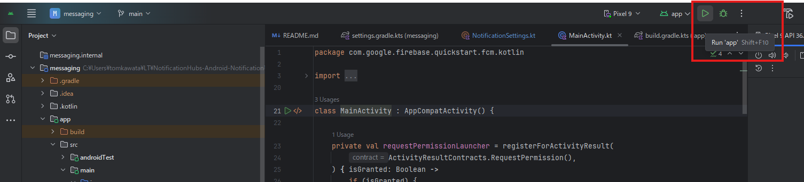
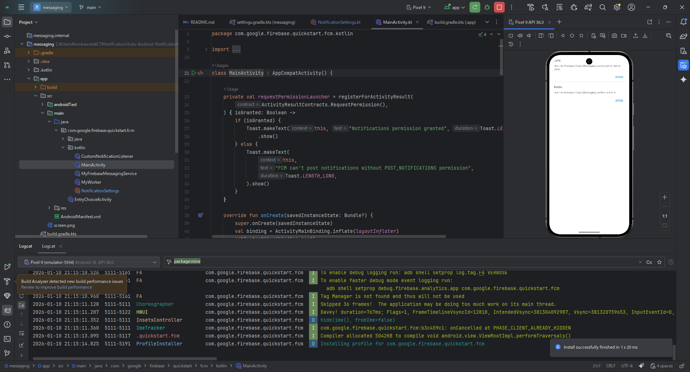
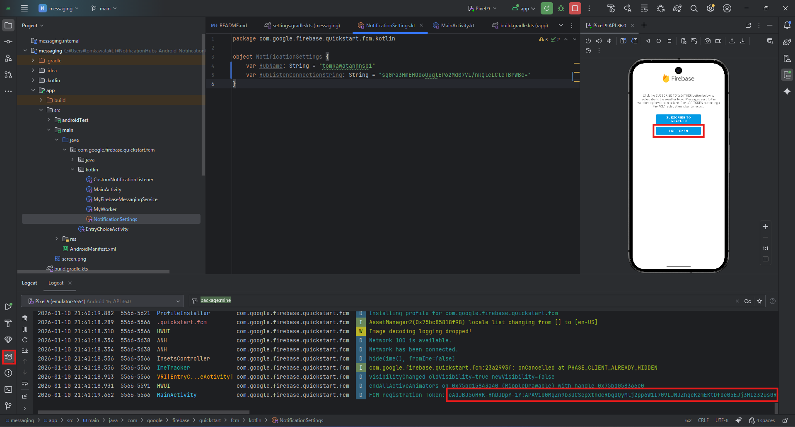
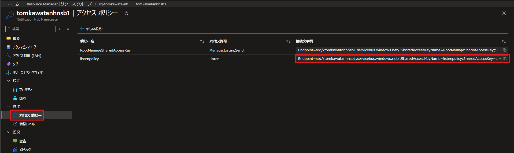
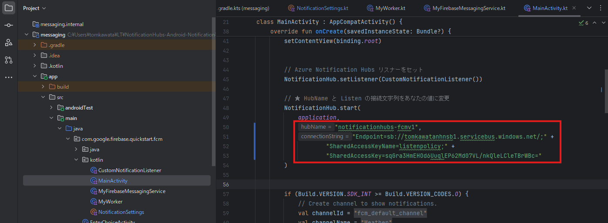
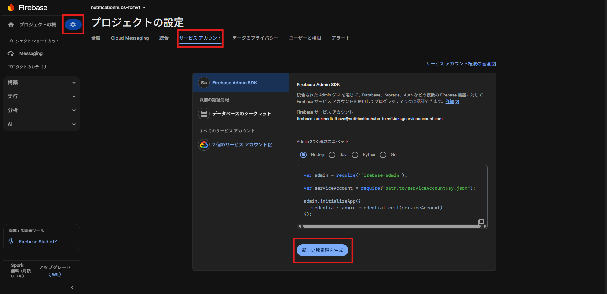
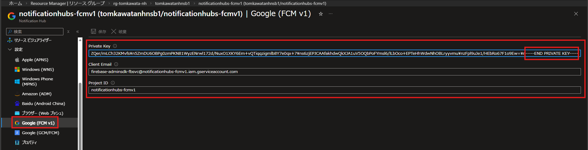
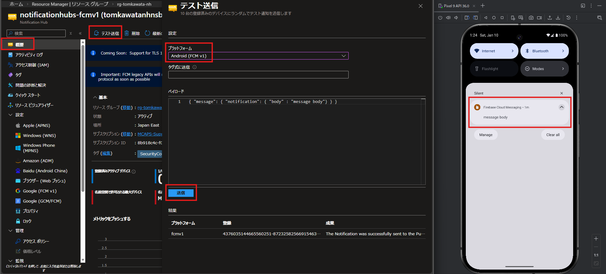

# このレポジトリで公開されているアプリケーションについて

[https://github.com/firebase/quickstart-android](https://github.com/firebase/quickstart-android) に公開されている Android アプリケーションを元に、/messeging 下にあるアプリケーションを Azure Notification Hubs に対応させたものです。

# 実行方法
## FCMv1 から Android に対する通知の送信
### 1.1. [https://firebase.google.com/docs/android/setup?hl=ja](https://firebase.google.com/docs/android/setup?hl=ja) を参考に下記を実施
- Android Studio のダウンロード
- Firebase プロジェクトの作成
- アプリを Firebase に登録
    - Package Name は "com.google.firebase.quickstart.fcm" を指定
- Firebase 構成ファイル (google-services.json) を追加
- ※ アプリに Firebase SDK は追加済み
- Android Studio で messaging フォルダを開き、プロジェクトを実行
    - ※ 実行は Android Studio の上部の Run 'app' (▷) ボタンを押下することで、Android Studio 標準のエミュレーターをターゲットとして行われる
    
    - 実行すると、下記のような画面となる
    

### 1.2. [https://firebase.google.com/docs/cloud-messaging/android/get-started?hl=ja](https://firebase.google.com/docs/cloud-messaging/android/get-started?hl=ja) を参考に FCM HTTP v1 API を使って Android へ通知を送信
- 本プロジェクト作成時点では、基本的に SDK の追加やマニフェスト ファイルの編集は実施済みのため、下記に沿って FCM v1 から通知を行う
    - [https://firebase.google.com/docs/cloud-messaging/android/get-started?hl=ja#send-notification-message](https://firebase.google.com/docs/cloud-messaging/android/get-started?hl=ja#send-notification-message)
    - デバイス トークンはアプリケーション起動画面より Kotolin 欄の "OPEN" 押下後、次の画面で "LOG TOKEN" ボタンを押下し、Android Studio の Logcat に出力される "FCM registration Token: " 以降の文字列のこと
    

### 2.1. Azure Notification Hub SDK をアプリケーションに構成
- Azure Notification Hubs 名前空間をデプロイし、Notification Hubs を作成する
    - [https://learn.microsoft.com/ja-jp/azure/notification-hubs/create-notification-hub-portal](https://learn.microsoft.com/ja-jp/azure/notification-hubs/create-notification-hub-portal)
- NotificationSettings.kt で、デプロイした Notification Hubs の名前空間名および上記で構成した Listen 用のポリシーの接続文字列を設定する

- Notification Hubs 名前空間 > アクセス ポリシー > + 新しいポリシー より Listen 用のポリシーを作成する

- 上記で作成した Notification Hub の Listen 用のポリシー を MainActivity.kt の OnCreate 内 NotificationHub.start に記述する

- Firebase コンソール > プロジェクト設定 > サービスアカウント > 新しい秘密鍵を生成より JSON を取得

- 上記で得た JSON のうち project_id, client_email, private_key を Notification Hub へ登録



### 2.2 Azure Notification Hubs にデバイス トークンを追加
- [REST API を使った登録情報の取得 - Notification Hubs のデバイス登録情報を取得する方法](https://azure.github.io/jpazpaas/2021/08/27/howto-get-registrations.html#rest-api-%E3%82%92%E4%BD%BF%E3%81%A3%E3%81%9F%E7%99%BB%E9%8C%B2%E6%83%85%E5%A0%B1%E3%81%AE%E5%8F%96%E5%BE%97) を参考に、SAS を作成し、Azure Notification Hubs へデバイス トークンを登録
    - 登録は下記のような内容で REST API を実行した
    ```
    ### 登録を作成する
    ### https://learn.microsoft.com/ja-jp/rest/api/notificationhubs/create-registration
    POST https://tomkawatanhnsb1.servicebus.windows.net/notificationhubs-fcmv1/registrations/?api-version=2015-01 HTTP/1.1
    Content-Type: application/atom+xml;type=entry;charset=utf-8
    Authorization: {{Authorization}}
    x-ms-version: 2015-01

    <?xml version="1.0" encoding="utf-8"?>
    <entry xmlns="http://www.w3.org/2005/Atom">
        <content type="application/xml">
            <FcmV1RegistrationDescription xmlns:i="http://www.w3.org/2001/XMLSchema-instance"
                xmlns="http://schemas.microsoft.com/netservices/2010/10/servicebus/connect">
                <Tags>learningthursday</Tags>
                <FcmV1RegistrationId>eAdJBJ5uRRK-HhDJDpY-1Y:APA91bGMqZn9b3UCSepXthdcRbgdQyMlj2pp6W1I7G9LJNJZhqcKzmEKtDfde05EJj3HIz32usGRwleaCvSL9I9jU3ZkNk3HFidX_4CcY5GhPsR-0BHpDJQ</FcmV1RegistrationId> ### ここにデバイストークンを入力
            </FcmV1RegistrationDescription>
        </content>
    </entry>
    ```

### 2.3 Azure Notification Hubs より通知を送信する
- Azure Portal > Notificaton Hub 概要ページ > テスト送信より通知を送信する
